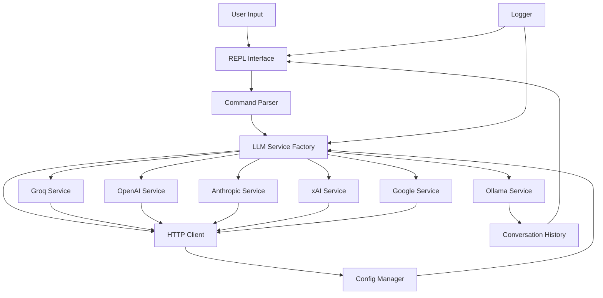

# CppMultiChat

A modern C++20 REPL (Read-Eval-Print-Loop) for interacting with multiple Large Language Model providers including Groq, OpenAI, Anthropic, xAI (Grok), Google (Gemini), and Ollama.

## Architecture



## Features

- Support for multiple LLM providers (Groq, OpenAI, Anthropic, xAI/Grok, Google/Gemini, Ollama)
- Interactive terminal interface with color support
- Streaming response support
- Conversation history management
- Configurable models and parameters
- Comprehensive logging with spdlog
- Cross-platform support (Linux, macOS, Windows)
- Unified HTTP client implementation with platform-specific optimizations

## Prerequisites

- C++20 compatible compiler (GCC 11+, Clang 14+, or MSVC 2019+)
- CMake 3.20 or higher
- Git (for submodules)
- Internet connection for downloading dependencies

## Quick Start

### 1. Clone the Repository

```bash
git clone https://github.com/cschladetsch/CppMultiChat.git
cd CppMultiChat
git submodule update --init --recursive
```

### 2. Configure API Keys

Copy the example configuration file and add your API keys:

```bash
cp config.example.json config.json
```

Edit `config.json` and add your API keys for the providers you want to use:

```json
{
  "providers": {
    "groq": {
      "api_key": "YOUR_GROQ_API_KEY_HERE",
      "api_url": "https://api.groq.com/openai/v1",
      "model": "llama-3.3-70b-versatile",
      "temperature": 0.7,
      "max_tokens": 8000
    },
    "openai": {
      "api_key": "YOUR_OPENAI_API_KEY_HERE",
      "api_url": "https://api.openai.com/v1",
      "model": "gpt-4-turbo-preview",
      "temperature": 0.7,
      "max_tokens": 4096
    },
    "anthropic": {
      "api_key": "YOUR_ANTHROPIC_API_KEY_HERE",
      "api_url": "https://api.anthropic.com/v1",
      "model": "claude-3-5-sonnet-20241022",
      "temperature": 0.7,
      "max_tokens": 4096
    },
    "xai": {
      "api_key": "YOUR_XAI_API_KEY_HERE",
      "api_url": "https://api.x.ai/v1",
      "model": "grok-beta",
      "temperature": 0.7,
      "max_tokens": 4096
    },
    "google": {
      "api_key": "YOUR_GOOGLE_API_KEY_HERE",
      "api_url": "https://generativelanguage.googleapis.com/v1beta",
      "model": "gemini-2.0-flash",
      "temperature": 0.7,
      "max_tokens": 8192
    },
    "ollama": {
      "model": "llama3.1",
      "temperature": 0.7,
      "max_tokens": 2048,
      "api_url": "http://localhost:11434"
    }
  },
  "provider": "groq"
}
```

**Important:** The `config.json` file is ignored by git to keep your API keys secure. Never commit API keys to version control.

### 3. Build the Project

```bash
mkdir build
cd build
cmake .. -DCMAKE_BUILD_TYPE=Release
make -j$(nproc)
```

### 4. Run the Application

```bash
./llm-repl
```

Or with verbose logging:

```bash
./llm-repl -v
```

## Configuration

### Configuration File

The application uses a JSON configuration file (`config.json`) to store API keys, model settings, and other preferences. The configuration file supports:

- Multiple provider configurations
- Model selection and parameters
- Temperature and token limits
- REPL interface settings
- Logging configuration

See `config.example.json` for a complete example.

### Command Line Options

```
-c, --config    Configuration file path (default: config.json)
-p, --provider  LLM provider (groq, openai, anthropic, xai, google, ollama)
-m, --model     Model to use
-k, --api-key   API key (not recommended - use config file)
-t, --temperature Temperature (0.0 - 2.0)
--max-tokens    Maximum tokens to generate
-v, --verbose   Enable verbose logging
--version       Show version information
```

### Environment Variables

You can also set API keys via environment variables:

- `GROQ_API_KEY` - Groq API key
- `OPENAI_API_KEY` - OpenAI API key
- `ANTHROPIC_API_KEY` - Anthropic API key
- `XAI_API_KEY` - xAI (Grok) API key
- `GOOGLE_API_KEY` - Google (Gemini) API key

## Usage

### Basic Commands

Once in the REPL, you can use the following commands:

- `/help` - Show available commands
- `/model [name]` - Switch to a different model
- `/clear` - Clear conversation history
- `/history` - Show conversation history
- `/save [file]` - Save conversation to file
- `/load [file]` - Load conversation from file
- `/system [prompt]` - Set system prompt
- `/exit` - Exit the REPL

### Example Session

```
LLM REPL v1.0.0
Provider: groq
Model: llama-3.3-70b-versatile
Type '/help' for commands or '/exit' to quit.

You> Tell me about quantum computing

AI> Quantum computing is a revolutionary computing paradigm that leverages quantum mechanical phenomena...

You> /provider anthropic
[INFO] Switched to provider: anthropic (claude-3-5-sonnet-20241022)

You> Can you explain it more simply?

AI> Sure! Think of quantum computing like this...
```

## Supported Providers

### Groq
- Fast inference with open-source models
- Models: Llama 3.3 (70B), Llama 3.1 (70B, 8B), Mixtral, Gemma 2
- Get API key from: https://console.groq.com

### OpenAI
- GPT-4 Turbo and GPT-3.5 models
- Get API key from: https://platform.openai.com

### Anthropic
- Claude 3.5 Sonnet, Claude 3 models (Opus, Haiku)
- Get API key from: https://console.anthropic.com

### xAI (Grok)
- Grok Beta model
- Get API key from: https://console.x.ai

### Google (Gemini)
- Gemini 2.0 Flash, Gemini 1.5 Pro models
- Get API key from: https://aistudio.google.com

### Ollama
- Local model execution
- No API key required
- Install from: https://ollama.ai

## Development

### Project Structure

```
CppMultiChat/
├── src/
│   ├── main.cpp           # Application entry point
│   ├── repl/              # REPL implementation
│   ├── llm/               # LLM service implementations
│   ├── http/              # HTTP client (unified implementation)
│   ├── models/            # Data models
│   └── utils/             # Utility functions
├── external/              # External dependencies
│   ├── spdlog/           # Logging library (git submodule)
│   ├── nlohmann_json/    # JSON library
│   ├── httplib/          # HTTP library
│   └── CLI11/            # Command line parser
├── tests/                 # Unit and integration tests
├── config.example.json    # Example configuration
├── config.demo.json      # Demo configuration
└── CMakeLists.txt        # CMake build configuration
```

### Building with Debug Info

```bash
cmake .. -DCMAKE_BUILD_TYPE=Debug
make -j$(nproc)
```

### Running Tests

```bash
./test_suite.sh
```

## Troubleshooting

### Connection Issues

If you see "Connection failed" errors:

1. Check your internet connection
2. Verify your API key is correct in `config.json`
3. Ensure the API URL is correct for your provider
4. Run with `-v` flag for detailed debug output

### API Key Issues

The application will show debug information about API keys when run with `-v`:
- Shows if API key is loaded (without revealing the actual key)
- Displays first/last 4 characters for verification
- Reports the length of the API key

### SSL/TLS Issues

If you encounter SSL errors:
- Ensure your system has up-to-date CA certificates
- On Ubuntu/Debian: `sudo apt-get install ca-certificates`
- On macOS: Certificates should be managed by the system

## Contributing

Contributions are welcome! Please:

1. Fork the repository
2. Create a feature branch
3. Make your changes
4. Run tests
5. Submit a pull request

## License

This project is licensed under the MIT License - see the LICENSE file for details.

## Acknowledgments

- [spdlog](https://github.com/gabime/spdlog) - Fast C++ logging library
- [nlohmann/json](https://github.com/nlohmann/json) - JSON for Modern C++
- [cpp-httplib](https://github.com/yhirose/cpp-httplib) - HTTP client library
- [CLI11](https://github.com/CLIUtils/CLI11) - Command line parser