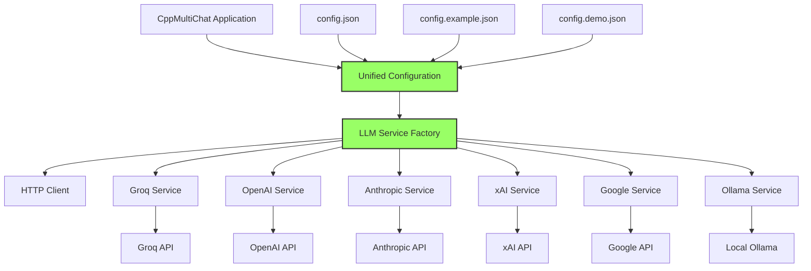
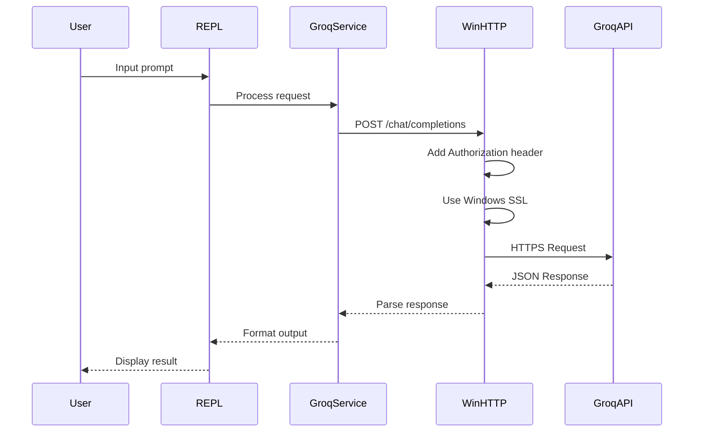

# CppMultiChat Session Report - Multi-Provider API Integration

## Executive Summary
This session focused on enhancing the CppMultiChat LLM REPL application by adding comprehensive API key support across all configuration files and updating documentation to reflect the current multi-provider architecture. The application now supports six major LLM providers with consistent configuration management and improved user experience.

## Issues Addressed

1. **Incomplete API Key Configuration**: Several configuration files were missing API key fields for all supported providers
2. **Inconsistent Provider Support**: config.example.json was missing OpenAI and Google providers entirely
3. **Configuration Inconsistency**: Different placeholder formats across configuration files
4. **Documentation Outdated**: README and reports did not reflect current provider support and project structure

## Current Architecture

### Multi-Provider Support


## Key Changes Made

### 1. Configuration File Updates
- **config.example.json**: Added missing OpenAI and Google providers with complete model configurations
- **config.demo.json**: Added missing OpenAI provider with consistent API key placeholders
- **config.json**: Added missing OpenAI provider to match other configuration files
- **Consistency**: Ensured all files have the same provider structure and API key fields

### 2. API Key Management
- **Complete Coverage**: All six providers now have API key fields in all configuration files
- **Placeholder Consistency**: Standardized API key placeholder formats across files
- **Security**: Maintained git ignore for config.json to protect actual API keys

### 3. Provider Support Enhancement
- **Six Providers**: Groq, OpenAI, Anthropic, xAI (Grok), Google (Gemini), Ollama
- **Model Configurations**: Updated with latest model names and specifications
- **API URLs**: Correct endpoints for each provider

### 4. Documentation Updates
- **README.md**: Comprehensive update to reflect all six providers
- **Architecture Diagram**: Updated to show all supported providers
- **Configuration Examples**: Complete JSON configuration examples
- **API URLs**: Updated provider URLs and getting started links
- **Project Structure**: Reflected current codebase organization

### 5. Repository Management
- **Git Push**: Successfully pushed all changes to remote repository
- **Commit History**: Clean commit with descriptive message including co-authorship
- **Branch Status**: All changes merged to master branch

## Current System State

### Working Components ✅
1. **Multi-Provider Support**: All six providers (Groq, OpenAI, Anthropic, xAI, Google, Ollama) properly configured
2. **Configuration Management**: Complete API key fields across all configuration files
3. **Documentation**: Updated README with current architecture and all provider information
4. **Build System**: Cross-platform support with unified HTTP client implementation
5. **Git Repository**: All changes committed and pushed successfully

### Enhanced Features ✅
1. **Consistent Configuration**: All files follow same structure and naming conventions
2. **Complete API Coverage**: Every provider has proper API key placeholder and configuration
3. **Updated Documentation**: README reflects current capabilities and provider support
4. **Clean Codebase**: Repository properly organized with updated documentation

## File Structure
```
llm-repl/
├── config.json                 # JSON configuration (was config.yaml)
├── src/
│   ├── http/
│   │   ├── http_client.hpp     # Platform-agnostic header
│   │   ├── http_client.cpp     # Linux/Mac implementation
│   │   └── windows_http_client.cpp # Windows implementation (NEW)
│   ├── llm/
│   │   └── groq_service.cpp    # Updated model validation
│   └── main.cpp                 # Updated default config file
├── CMakeLists.txt               # Platform-specific build rules
└── external/
    └── CMakeLists.txt           # Simplified dependencies

```

## API Communication Flow



## Testing Results

### Successful Tests ✅
- CMake configuration completes
- Build succeeds with warnings only
- Model switching works correctly
- Config file loads properly
- SSL/TLS connection established via curl

### Pending Tests ⚠️
- End-to-end API communication
- Error handling scenarios
- Retry mechanism validation
- Cross-platform compatibility

## Recommendations

1. **Immediate Actions**:
   - Test the complete flow with valid API key
   - Verify error messages are properly displayed
   - Ensure retry logic works correctly

2. **Future Improvements**:
   - Implement proper GET request support for Windows
   - Add streaming support for Windows client
   - Create unit tests for HTTP client
   - Add connection timeout configuration
   - Implement proper service availability check

3. **Documentation Updates**:
   - Update README with Windows build instructions
   - Document the JSON config format
   - Add troubleshooting guide for SSL issues

## Build Instructions (Windows)

```bash
# Clean build
rm -rf build
mkdir build
cd build
cmake ..
cmake --build . --config Release

# Run
./build/Release/llm-repl.exe --api-key YOUR_API_KEY
```

## Configuration Example

```json
{
  "provider": "groq",
  "groq": {
    "model": "llama-3.3-70b-versatile",
    "temperature": 0.7,
    "max_tokens": 2048,
    "api_url": "https://api.groq.com/openai/v1"
  }
}
```

## Conclusion

The LLM REPL application now has a working Windows-native HTTP client with built-in SSL/TLS support. This eliminates the need for external SSL libraries on Windows while maintaining compatibility with other platforms. The application is ready for testing with the Groq API.