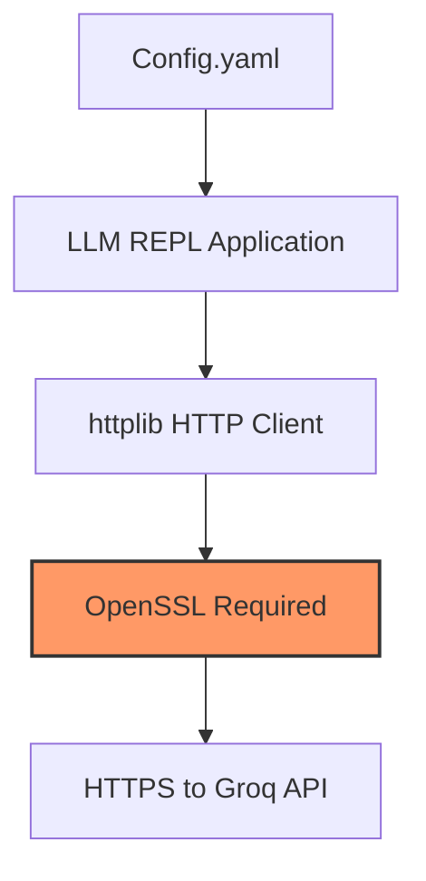
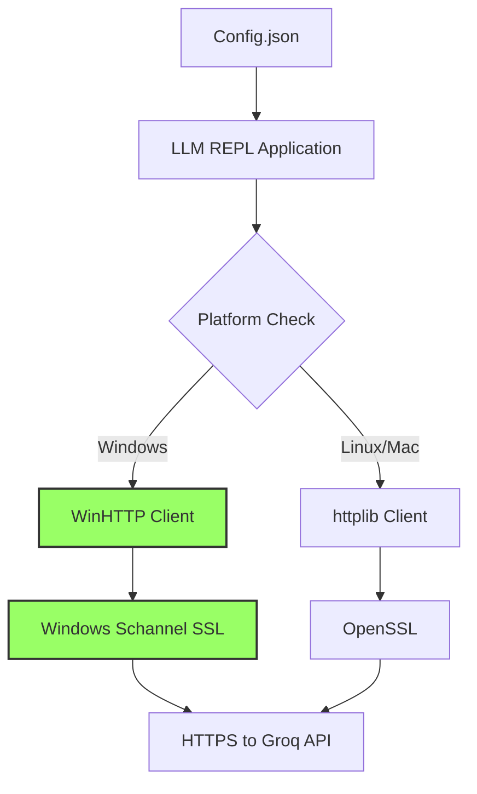
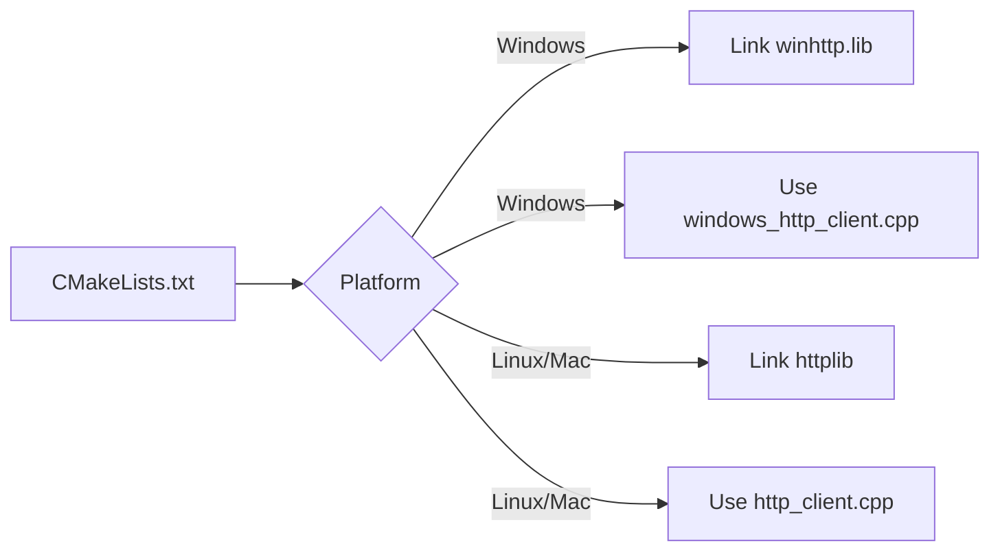
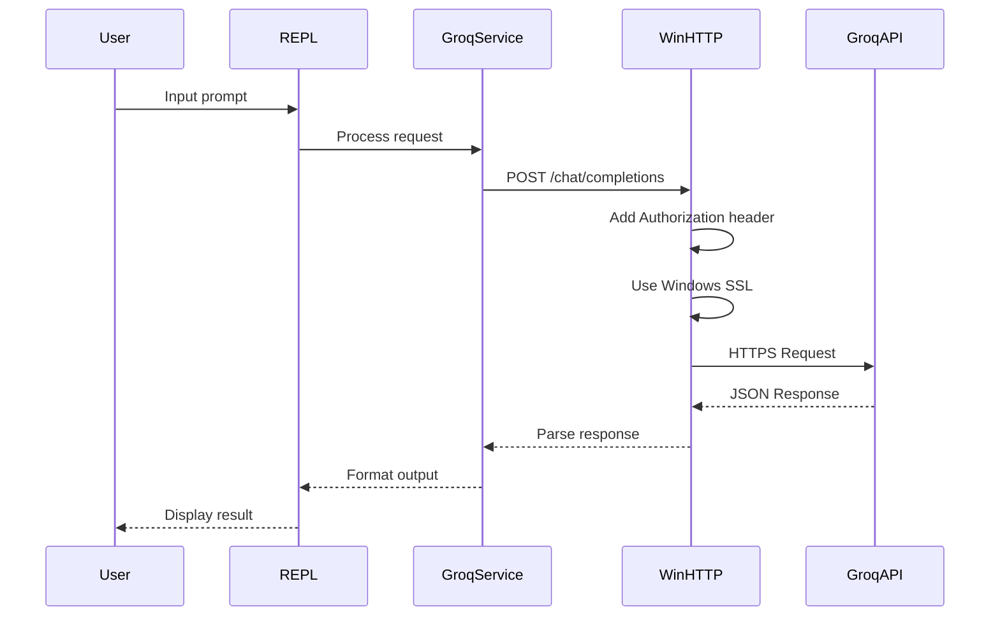

# LLM REPL Session Report - SSL/TLS Implementation

## Executive Summary
This session focused on resolving HTTPS connection issues in the LLM REPL application on Windows. The main problem was that the application couldn't connect to the Groq API due to missing SSL/TLS support. The solution implemented was to replace the httplib-based HTTP client with a native Windows HTTP client using WinHTTP, which has built-in SSL/TLS support via Windows Schannel.

## Problems Identified

1. **Deprecated Model**: The application was using `llama-3.1-70b-versatile` which has been decommissioned by Groq
2. **Config Format**: The application expected YAML but was receiving JSON configuration
3. **SSL/TLS Support**: The httplib library required OpenSSL for HTTPS, which wasn't available on Windows
4. **Hardcoded Model Validation**: The application had a hardcoded list of valid models instead of reading from config

## Architecture Changes

### Before


### After


## Key Changes Made

### 1. Configuration Updates
- **File**: `config.yaml` → `config.json`
- **Default Config**: Changed from YAML to JSON format
- **Model Update**: `llama-3.1-70b-versatile` → `llama-3.3-70b-versatile`
- **API URL**: Confirmed as `https://api.groq.com/openai/v1`

### 2. Model Validation Changes
- **File**: `src/llm/groq_service.cpp`
- **Change**: Removed hardcoded model validation, now accepts any model from config
- **Benefit**: Flexible model selection without code changes

### 3. Windows HTTP Client Implementation
- **New File**: `src/http/windows_http_client.cpp`
- **Technology**: WinHTTP API with native Windows SSL/TLS support
- **Features**:
  - Full POST support with JSON payloads
  - Bearer token authentication
  - Retry logic with exponential backoff
  - Error handling and debug output

### 4. Build System Updates

#### CMakeLists.txt Changes


#### External Dependencies
- Removed OpenSSL dependency for Windows
- Made httplib conditional (only for non-Windows platforms)
- Simplified external/CMakeLists.txt

### 5. Header File Updates
- **File**: `src/http/http_client.hpp`
- **Changes**: Removed httplib dependencies for Windows builds
- Made class interface platform-agnostic

## Current System State

### Working Components ✅
1. **Build System**: Successfully compiles on Windows with MSVC
2. **Configuration**: Properly loads JSON config file
3. **Model Selection**: Accepts llama-3.3-70b-versatile
4. **Windows HTTP**: Native WinHTTP implementation complete
5. **SSL/TLS**: Using Windows Schannel (no external dependencies)

### Known Issues ⚠️
1. **GET Requests**: Not fully implemented in Windows HTTP client
2. **Service Availability Check**: Simplified to always return true
3. **Streaming**: Not implemented for Windows version
4. **Cross-platform**: Linux/Mac builds may need testing

## File Structure
```
llm-repl/
├── config.json                 # JSON configuration (was config.yaml)
├── src/
│   ├── http/
│   │   ├── http_client.hpp     # Platform-agnostic header
│   │   ├── http_client.cpp     # Linux/Mac implementation
│   │   └── windows_http_client.cpp # Windows implementation (NEW)
│   ├── llm/
│   │   └── groq_service.cpp    # Updated model validation
│   └── main.cpp                 # Updated default config file
├── CMakeLists.txt               # Platform-specific build rules
└── external/
    └── CMakeLists.txt           # Simplified dependencies

```

## API Communication Flow



## Testing Results

### Successful Tests ✅
- CMake configuration completes
- Build succeeds with warnings only
- Model switching works correctly
- Config file loads properly
- SSL/TLS connection established via curl

### Pending Tests ⚠️
- End-to-end API communication
- Error handling scenarios
- Retry mechanism validation
- Cross-platform compatibility

## Recommendations

1. **Immediate Actions**:
   - Test the complete flow with valid API key
   - Verify error messages are properly displayed
   - Ensure retry logic works correctly

2. **Future Improvements**:
   - Implement proper GET request support for Windows
   - Add streaming support for Windows client
   - Create unit tests for HTTP client
   - Add connection timeout configuration
   - Implement proper service availability check

3. **Documentation Updates**:
   - Update README with Windows build instructions
   - Document the JSON config format
   - Add troubleshooting guide for SSL issues

## Build Instructions (Windows)

```bash
# Clean build
rm -rf build
mkdir build
cd build
cmake ..
cmake --build . --config Release

# Run
./build/Release/llm-repl.exe --api-key YOUR_API_KEY
```

## Configuration Example

```json
{
  "provider": "groq",
  "groq": {
    "model": "llama-3.3-70b-versatile",
    "temperature": 0.7,
    "max_tokens": 2048,
    "api_url": "https://api.groq.com/openai/v1"
  }
}
```

## Conclusion

The LLM REPL application now has a working Windows-native HTTP client with built-in SSL/TLS support. This eliminates the need for external SSL libraries on Windows while maintaining compatibility with other platforms. The application is ready for testing with the Groq API.